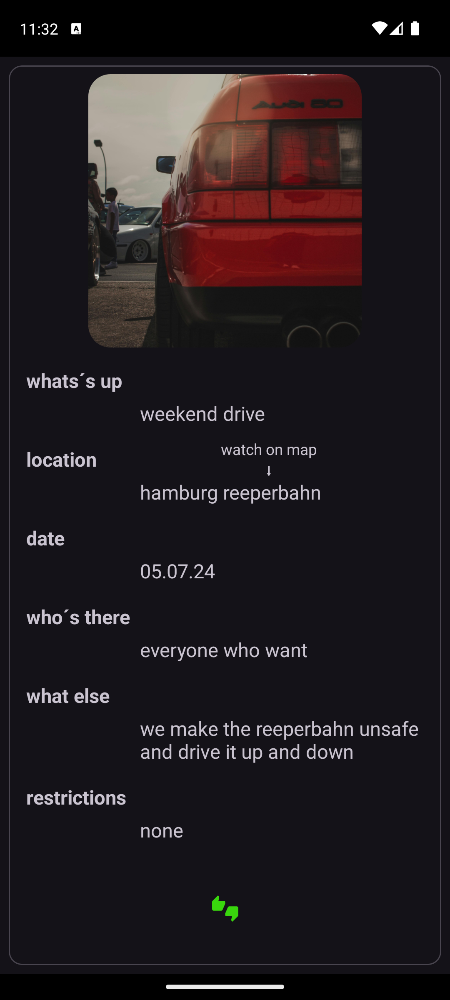

## BoostHub

BoostHub ist eine Community-App für Liebhaber des Tunings.

Mit ihr können tuningbegeisterte Nutzer Chats untereinander starten, indem sie ihren Chatpartner über eine E-Mail hinzufügen.

Sie können Events erstellen und mit wichtigen Daten versehen, wie zum Beispiel einer Location. Wenn der Benutzer auf diese Location klickt, wird er zu Google Maps weitergeleitet, wo die genaue Adresse mittels eines Pins angezeigt wird.

Beim Erstellen eines Events wird automatisch ein Gruppenchat erstellt, dem Benutzer sich mittels eines Likes anschließen oder mit einem Dislike wieder verlassen können.

	 &nbsp; &nbsp; &nbsp; &nbsp; 

## Try it yourself

- Klone einfach dieses Projekt.
- Erstelle eine APK oder teste es im Emulator.
- Erstelle dann ein Profil mit einer ausgedachten E-Mail-Adresse.

Nun kannst du beginnen, BoostHub zu erkunden. Erstelle einen Chat und schreibe Nachrichten. Oder du erstellst ein eigenes Event und lädst ein Foto hoch, um dein Event noch anschaulicher zu gestalten.

Ich weise ausdrücklich darauf hin, dass die verwendeten Daten beim Nutzen von BoostHub in Firebase gespeichert werden und diese in der aktuellen Version der App noch nicht vom Benutzer selbst gelöscht werden können.

### Bitte verwende keine privaten Daten, wenn du BoostHub testest!
## Features

Wenn User Daten gelöscht werden sollen, schreiben sie bitte einem [E-Mail](malteoppermann@gmx.net) mit dem Betreff löschen und der Log-in E-Mail Adresse, damit die Löschung erfolgen kann.

- [Firebase](https://firebase.google.com) (Authentication/Cloud Firestore/Storage)
- Api ([OpenStreetMap](https://www.openstreetmap.org/#map=6/51.330/10.453))
- Login und Sign Up
- erstellen und bearbeiten eines Profiles 
- erstellen und bearbeiten von Chats und Gruppen Chats 
- erstellen und bearbeiten von Events
- Weiterleitung über einen Intent zu Google Maps
- Light/dark mode
## Development Environment

Die App ist vollständig in Kotlin mit Android Studio geschrieben und nutzt das Gradle-Build-System.

Implementierung:

- [Navigation](https://developer.android.com/guide/navigation)
- [Retrofit](https://square.github.io/retrofit/) und [Moshi](https://github.com/square/moshi)
- [HTTP loginInterceptor](https://github.com/square/okhttp/tree/master/okhttp-logging-interceptor)
- [Coil](https://github.com/coil-kt/coil#jetpack-compose)
- [Firerbase](https://firebase.google.com)
## Architecture

Die Architektur basiert auf Android-Components. Die Logik wird von der MainAktivity und den Fragmenten ferngehalten und befindet sich im [ViewModel](https://developer.android.com/topic/libraries/architecture/viewmodel). Daten werden mithilfe von [LiveData](https://developer.android.com/topic/libraries/architecture/livedata) und werden mittels Binding in den einzelnen Fragmenten an das Layout gebunden. [Navigation component](https://developer.android.com/guide/navigation) wird verwendet, um eine Navigation in der App zu implementieren.

Die überwiegende Verwaltung der Daten finden im MainViewModel statt. Die API wird zusätzlich im Repository verwaltet. 

Das MainViewModel ist in mehrere Regionen unterteilt, so das eine bessere Übersicht und schnellere Navigation im ViewModel möglich ist.

Sie teilt sich auf in:

 #### FirebaseUserManagment

 - Verwaltung der Daten des einzelnen Users.

 #### FirebaseDataManagment

 Das sich weiter Unterteil in:

 #### FirebaseChatManagment

 - Verwaltung der Daten für den Chat.
 und 
 #### FirebaseEventManagement

 - Verwaltung der Daten für ein Event.

 #### API openstreetmap

 - Schnittstelle zum Repository für die API.
## FAQ

#### Gab es während der Entwicklung besondere Herausforderungen oder Schwierigkeiten, die du überwinden musstest, insbesondere im Zusammenhang mit der Integration von Funktionen für Events, Treffen und Chats?

Einige Schwierigkeiten lagen im Chat, dieser ist auch in der aktuellen Version noch nicht 100 % fertig. (Man ist nie fertig) Der Gruppenchat ist mit Abstand das schwierigste gewesen, da dieser in mehreren Bereichen der Datenstruktur ansetzt.

#### Gibt es Möglichkeiten für die Nutzer, Bilder oder Videos ihrer getunten Autos hochzuladen oder zu teilen?

Aktuell gibt es noch keine Möglichkeit für User, Bilder oder Videos hochzuladen oder zu teilen. Momentan kann man nur Bilder für das Profilbild oder ein Event hochgeladen werden.

#### Wie siehst du die Weiterentwicklung der Sicherheits- und Datenschutzfunktionen deiner App, insbesondere im Hinblick auf den Schutz sensibler Informationen der Nutzer während der Kommunikation und des Austauschs von Inhalten?

Die aktuelle Version von BoostHub hat noch keine Sicherheits- und Datenschutzfunktionen. Diese müssen bei einer Vollversion mit implementiert werden.

#### Siehst du Potenzial für weitere Verbesserungen und Erweiterungen, oder betrachtest du das Projekt nach dem Abschluss als abgeschlossen?

BoostHub bietet noch sehr viel Raum für weitere Features und Verbesserungen der bestehenden. Ich denke, dass ein Projekt nie wirklich abgeschlossen ist. Wenn ein Projekt abgeschlossen ist, wird es nicht mehr genutzt. Ein gutes Projekt muss stets und ständig weiter entwickelt werden.

#### Angesichts dessen, dass deine App derzeit Teil eines Abschlussprojekts ist, wie stehst du zur Idee, die Entwicklung nach Abschluss des Projekts fortzusetzen und die App möglicherweise zu veröffentlichen?

Die Idee ist super, jedoch benötigt dies Zeit und Ressourcen.
Eine Weiterentwicklung macht für mich nur Sinn, wenn die Nachfrage besteht und die Kosten und Ressourcen, die benötigt werden, auch wieder erwirtschaftet werden können. 
## Possible Features

- Notifikation

- Erweiterung der Chat und Gruppenchat Funktionen.

- Weitere Individualisierung des User Profiles.

- Möglichkeit zum Einsehen fremder User Profile.

- Eine interne Karte, die speziell Werkstätten für Tuner anzeigt.

- Werbung von Tuningzubehör verschiedenster Anbieter.
## Authors

- [@mo5e5](https://github.com/mo5e5)

## License

- [OpenStreetMap](https://www.openstreetmap.org/copyright)
- [Images](https://www.pexels.com/de-de/lizenz/)
